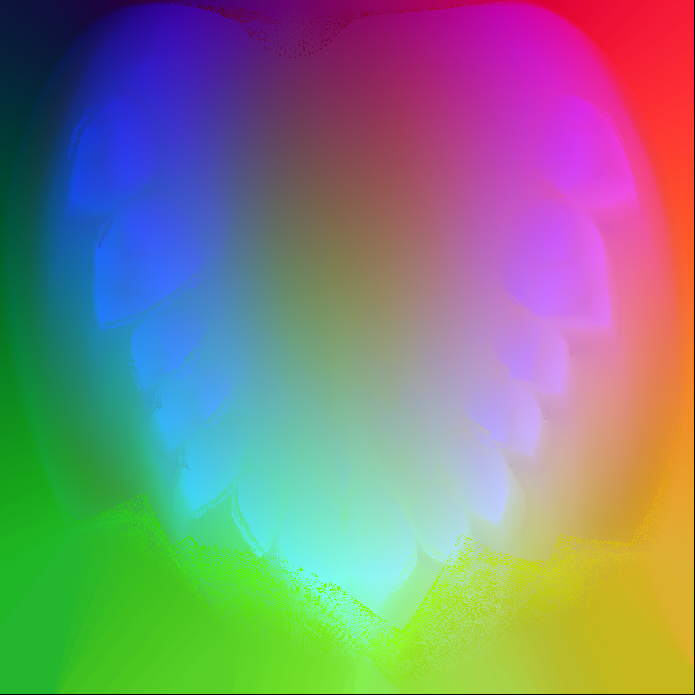

## OA-CNN: Oral Ad Junction Prediction using Convolutional Neural Networks

This project aims to provide a complete and robust pipeline capable of processing 3D models (both directly and indirectly scanned) of oral cavities and generate a mesh of the desired oral ad junction required by health professional.

The goal being saving both material costs, time of design and avoid the inherent loss of precision caused by the use of phase changing materials.

## Requirements

  - Python 3.x
  - numpy
  - scipy
  - scikit-learn
  - keras
  - PIL
  - trimesh
  - rtree
  - dijkstar
  - matplotlib


# Idea

The idea is to convert the input model into a 2D image in a continuous and non destructive way, basically like cutting a sphere and spreading it flat.
In he example below, we see an oral scan spread in that manner. the x and y position are left as close as possible from their original value, while the colour encode normalized value of z.



When pairs of the oral scan and the appropriate ad junction are produced by the processing step, we can feed them through a traditional CNN and train a model that can predict the correct ad junction based on new and unseen oral scans.

Once the ad junction image is predicted, it is used as a template to produce a 3D mesh of the ad junction, ideally ready to be printed.

## Example

This a dummy example using only one training example.

```python
import oa_cnn
import numpy as np
from PIL import Image

# processing one example
empreinte = 'empreinte.stl'
adjonction = 'adjunction.stl'
ensemble = 'ensemble.stl'

obj = DA.dental_processing(empreinte=empreinte, adjonction=adjonction,
                           ensemble=ensemble, id_=1, mode='arc')

# usue the example to train the CNN
DA.dental_cnn.train(size=50, e='flat_empreint_1.png', g='flat_adjunction_ana_1.png')

imread = DA.dental_cnn.imread

data = np.expand_dims(imread(DA.dental_cnn.resize_image('flat_empreint_1.png')), axis=0)
labels = np.expand_dims(imread(DA.dental_cnn.resize_image('flat_adjunction_ana_1.png')), axis=0)

x_train, x_test = data, data
y_train, y_test = labels, labels

# predict the adjunction based on the single training example
DA.dental_cnn.load(x_train, y_train, id_=0, size=52, show=True)
```

## TODO

The project is still under heavy development, the following tasks are the most pressing to solve:
    - Replace the *rtree* and *djikstra* dependencies for more stable and mainstream alternatives.
    - Implement the *remesh* method in order to convert the resulting image into a mesh. 
    - Find a more robust approach to handing occlusion.
    - Add documentation

## Author

- Mallek Mounir.
- The icp module is the original work of [Clay Flanningan](https://github.com/ClayFlannigan/icp).
